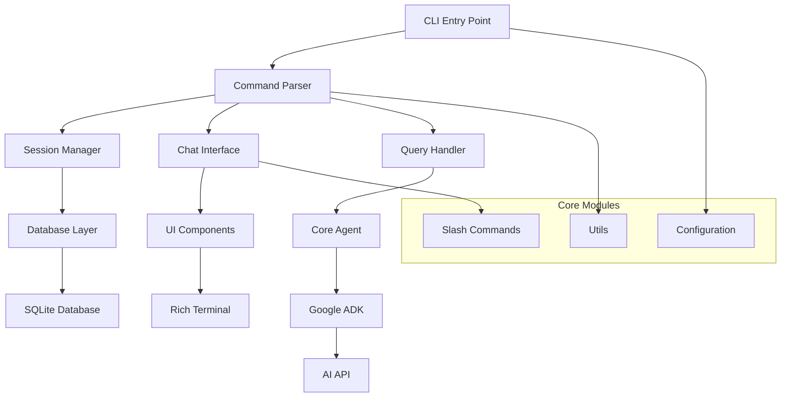
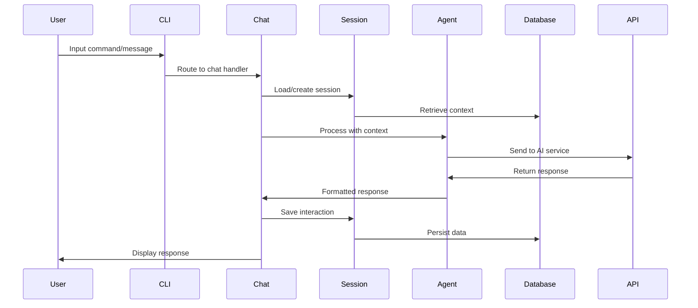
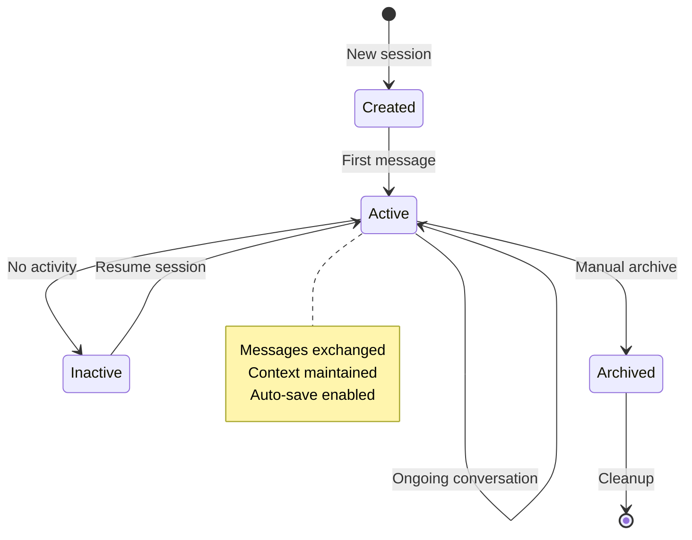
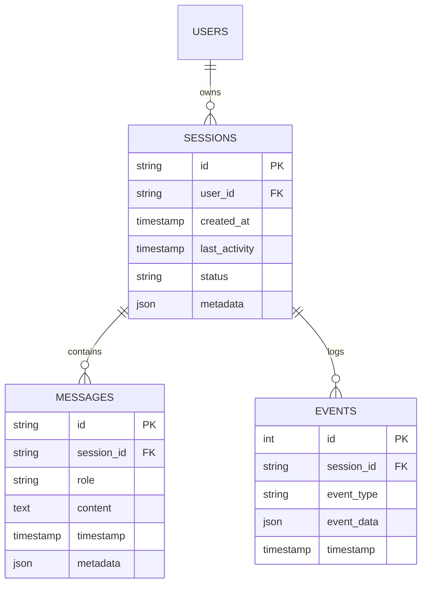
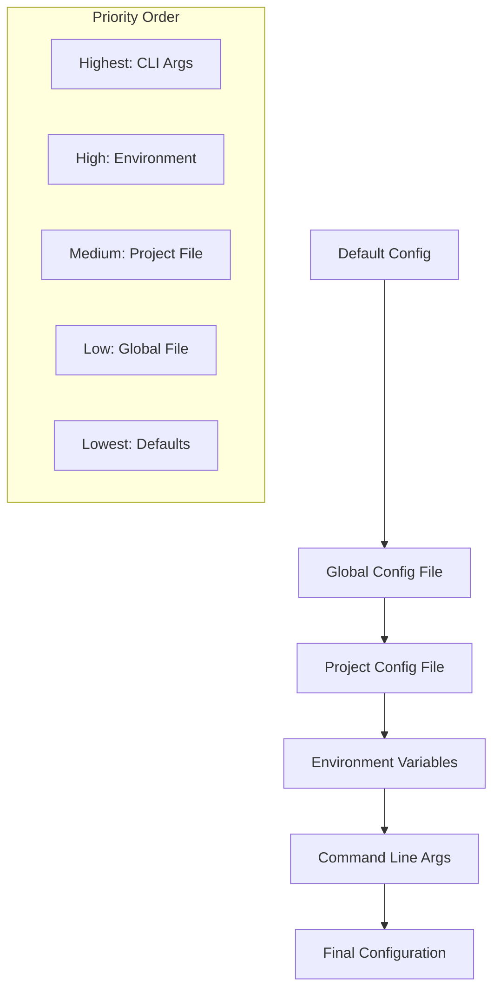
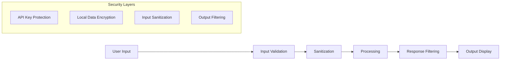
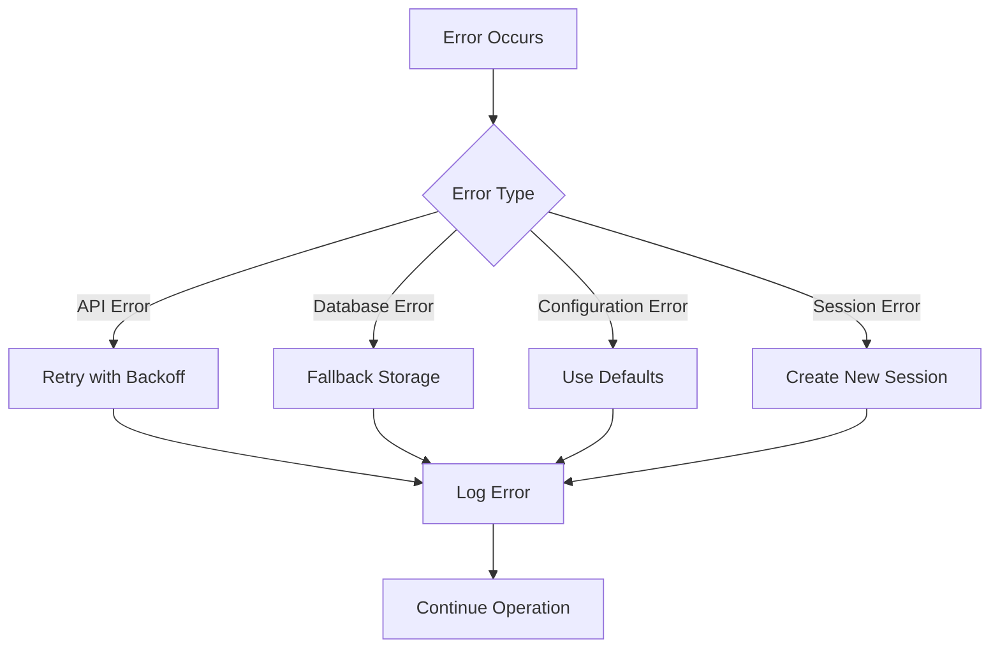

# Architecture

Murlix is built with a clean, modular architecture that emphasizes maintainability, extensibility, and performance. This guide provides an in-depth look at how Murlix is structured and how its components work together.

## System Overview



## Core Components

### 1. CLI Entry Point (`__init__.py`)

The main entry point handles command-line argument parsing and application orchestration.

**Key Responsibilities:**
- Command-line interface definition
- Application initialization
- Command routing and dispatch
- Error handling and logging setup

**Key Functions:**
```python
@click.group()
def main():
    """Main CLI entry point"""
    
@main.command()
def continue_chat():
    """Continue most recent session"""
    
@main.command() 
def load_chat():
    """Load specific session"""
```

### 2. Chat Interface (`chat.py`)

Manages the interactive chat loop and real-time user interactions.

**Key Responsibilities:**
- Interactive chat session management
- User input processing
- Response formatting and display
- Session state management

**Architecture Pattern:**
```python
class ChatInterface:
    def __init__(self, session_manager, agent):
        self.session_manager = session_manager
        self.agent = agent
        self.ui = UIComponents()
    
    async def start_chat_loop(self):
        """Main chat interaction loop"""
        while True:
            user_input = self.get_user_input()
            if self.is_command(user_input):
                self.handle_command(user_input)
            else:
                response = await self.agent.process(user_input)
                self.ui.display_response(response)
```

### 3. Session Management (`session.py`)

Handles persistent conversation storage and retrieval.

**Key Responsibilities:**
- Session creation and lifecycle management
- Conversation persistence
- Session metadata management
- Database operations

**Data Model:**
```python
class Session:
    id: str
    user_id: str
    created_at: datetime
    last_activity: datetime
    status: SessionStatus
    metadata: dict
    
class Message:
    id: str
    session_id: str
    role: MessageRole  # USER, ASSISTANT, SYSTEM
    content: str
    timestamp: datetime
```

### 4. UI Components (`ui.py`)

Provides rich terminal interface components and formatting.

**Key Responsibilities:**
- ASCII art and branding
- Response formatting and display
- Terminal interaction components
- Visual feedback and indicators

**Component Structure:**
```python
class UIComponents:
    def display_welcome_screen(self):
        """Show ASCII art welcome"""
        
    def format_response(self, content: str) -> Panel:
        """Format AI response in rich panel"""
        
    def display_session_table(self, sessions: List[Session]):
        """Show sessions in formatted table"""
```

### 5. Slash Commands (`slash_commands.py`)

Implements the slash command system for enhanced functionality.

**Key Responsibilities:**
- Command registration and routing
- Command handler implementation
- Help system and command discovery
- Command validation and error handling

**Command Architecture:**
```python
@dataclass
class SlashCommand:
    name: str
    description: str
    handler: Callable
    usage: str

slash_commands = {
    "/help": SlashCommand(
        name="help",
        description="Show available commands",
        handler=handle_help,
        usage="/help"
    )
}
```

### 6. Core Agent (`core_agent/agent.py`)

Configures and manages the AI agent using Google's ADK.

**Key Responsibilities:**
- AI agent configuration and initialization
- Tool integration and management
- Model selection and parameters
- Response processing and formatting

**Agent Configuration:**
```python
root_agent = LlmAgent(
    model='gemini-2.0-flash',
    name='Murlix_Assistant',
    instruction="""System instructions for the agent""",
    tools=mcp_toolsets
)
```

## Data Flow Architecture

### Request Processing Flow



### Session Lifecycle



## Database Schema

### Core Tables

```sql
-- Sessions table
CREATE TABLE sessions (
    id TEXT PRIMARY KEY,
    user_id TEXT NOT NULL,
    created_at TIMESTAMP DEFAULT CURRENT_TIMESTAMP,
    last_activity TIMESTAMP DEFAULT CURRENT_TIMESTAMP,
    status TEXT DEFAULT 'active',
    metadata JSON
);

-- Messages table  
CREATE TABLE messages (
    id TEXT PRIMARY KEY,
    session_id TEXT REFERENCES sessions(id),
    role TEXT NOT NULL, -- 'user', 'assistant', 'system'
    content TEXT NOT NULL,
    timestamp TIMESTAMP DEFAULT CURRENT_TIMESTAMP,
    metadata JSON
);

-- Events table (for logging)
CREATE TABLE events (
    id INTEGER PRIMARY KEY AUTOINCREMENT,
    session_id TEXT REFERENCES sessions(id),
    event_type TEXT NOT NULL,
    event_data JSON,
    timestamp TIMESTAMP DEFAULT CURRENT_TIMESTAMP
);
```

### Relationships



## Configuration System

### Configuration Hierarchy



### Configuration Sources

1. **Default Configuration**: Built-in defaults
2. **Global Config**: `~/.murlix/config.json`
3. **Project Config**: `.murlix.json` in project root
4. **Environment Variables**: `MURLIX_*` prefixed variables
5. **Command Line**: Explicit CLI arguments

## Extension Points

### 1. Custom Slash Commands

```python
# Register new command
def handle_export():
    """Export current session"""
    # Implementation here
    
slash_commands["/export"] = SlashCommand(
    name="export",
    description="Export current session",
    handler=handle_export,
    usage="/export [format]"
)
```

### 2. Custom UI Components

```python
# Extend UI components
class CustomUI(UIComponents):
    def display_custom_panel(self, data):
        """Custom display component"""
        panel = Panel(
            data,
            title="Custom Display",
            border_style="green"
        )
        console.print(panel)
```

### 3. Agent Tool Integration

```python
# Add custom tools to agent
from google_adk import Tool

custom_tool = Tool(
    name="custom_action",
    description="Perform custom action",
    handler=custom_handler
)

# Add to agent toolset
mcp_toolsets.append(custom_tool)
```

### 4. Database Extensions

```python
# Extend database schema
class CustomSessionManager(SessionManager):
    async def add_custom_metadata(self, session_id: str, metadata: dict):
        """Add custom metadata to session"""
        # Implementation
```

## Performance Considerations

### Memory Management

- **Session Caching**: Recent sessions cached in memory
- **Message Pagination**: Large conversations paginated
- **Resource Cleanup**: Automatic cleanup of unused resources

### Database Optimization

- **Indexing**: Strategic indexes on frequently queried columns
- **Connection Pooling**: Efficient database connection management
- **Batch Operations**: Bulk operations for better performance

### API Efficiency

- **Request Batching**: Multiple operations in single API call
- **Response Caching**: Cache frequent responses locally
- **Rate Limiting**: Respect API rate limits and quotas

## Security Architecture

### Data Protection



### Security Measures

1. **API Key Security**: Environment variable storage, no hardcoding
2. **Input Validation**: Sanitize user input before processing
3. **Output Filtering**: Remove sensitive data from responses
4. **Local Encryption**: Optional database encryption
5. **Access Control**: User-based session isolation

## Error Handling Strategy

### Error Categories

```python
class MurlixError(Exception):
    """Base exception for Murlix"""
    
class SessionError(MurlixError):
    """Session-related errors"""
    
class APIError(MurlixError):
    """API communication errors"""
    
class ConfigurationError(MurlixError):
    """Configuration-related errors"""
```

### Error Recovery



## Testing Architecture

### Test Structure

```
tests/
├── unit/
│   ├── test_session_manager.py
│   ├── test_chat_interface.py
│   └── test_slash_commands.py
├── integration/
│   ├── test_full_workflow.py
│   └── test_database_integration.py
└── e2e/
    ├── test_cli_commands.py
    └── test_interactive_mode.py
```

### Testing Patterns

- **Unit Tests**: Individual component testing
- **Integration Tests**: Component interaction testing
- **End-to-End Tests**: Full user workflow testing
- **Mock Services**: Mock external dependencies

## Deployment Architecture

### Package Structure

```
murlix/
├── src/murlix/
│   ├── __init__.py       # CLI entry point
│   ├── chat.py           # Chat interface
│   ├── session.py        # Session management
│   ├── ui.py             # UI components
│   ├── slash_commands.py # Command handlers
│   ├── core_agent/       # Agent configuration
│   └── utils/            # Utilities
├── tests/                # Test suite
├── docs/                 # Documentation
└── pyproject.toml        # Package configuration
```

### Distribution

- **Python Package**: Installable via pip/uv
- **Entry Points**: CLI commands via `pyproject.toml`
- **Dependencies**: Managed through `pyproject.toml`
- **Documentation**: Hosted on GitHub Pages

## Next Steps

- **[Extending Murlix](extending.md)**: Learn how to extend functionality
- **[Custom Commands](custom-commands.md)**: Create your own slash commands
- **[Agent Configuration](agent-configuration.md)**: Customize the AI agent

!!! info "Architecture Benefits"
    This modular architecture provides:
    - **Maintainability**: Clear separation of concerns
    - **Extensibility**: Easy to add new features
    - **Testability**: Components can be tested in isolation
    - **Performance**: Optimized data flow and resource usage