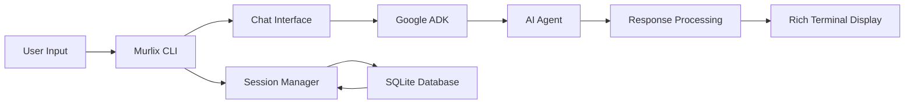

# Overview

Welcome to **Murlix** – a revolutionary CLI chat interface that transforms how you interact with AI agents in the terminal. Built on Google's powerful Agent Development Kit (ADK), Murlix combines the efficiency of command-line tools with the elegance of modern user interfaces.

## What is Murlix?

Murlix is more than just another CLI tool. It's a comprehensive platform that brings beautiful, interactive AI conversations directly to your terminal, complete with:

- **Rich Visual Interface**: ASCII art, elegant formatting, and responsive design
- **Intelligent Session Management**: Persistent conversations that survive restarts
- **Extensible Architecture**: Easy-to-customize agent configurations and commands
- **Modern UX**: Loading indicators, status panels, and intuitive interactions

## Core Philosophy

!!! quote "Design Principles"
    Murlix is built on the belief that command-line tools don't have to be ugly or difficult to use. We combine the power and flexibility of the terminal with modern design principles to create an experience that's both functional and delightful.

### Beautiful by Default

Every interaction in Murlix is designed to be visually appealing:

```bash
╭─ Murlix ─────────────────────────────────────────────────────────────────────╮
│ Hello! I'm your AI assistant. I can help you with coding, writing,           │
│ problem-solving, and much more. What would you like to work on today?        │
╰──────────────────────────────────────────────────────────────────────────────╯
```

### Intelligent and Context-Aware

Murlix remembers your conversations and maintains context across sessions, making it feel like you're talking to a knowledgeable colleague rather than a stateless tool.

### Extensible and Customizable

Built with modularity in mind, Murlix allows you to:

- Add custom slash commands
- Configure AI agent behavior
- Integrate with external tools and APIs
- Customize the visual appearance

## Who Should Use Murlix?

Murlix is perfect for:

=== "Developers"
    - **Code Reviews**: Get AI assistance with code analysis and improvements
    - **Debugging**: Interactive problem-solving sessions
    - **Learning**: Ask questions and get explanations while coding
    - **Documentation**: Generate and review documentation

=== "System Administrators"
    - **Troubleshooting**: Interactive diagnostic sessions
    - **Script Generation**: AI-assisted automation scripts
    - **System Analysis**: Get insights on system performance and issues
    - **Documentation**: Maintain system documentation with AI help

=== "Researchers & Writers"
    - **Research Assistance**: Interactive research and fact-checking
    - **Content Creation**: Collaborative writing and editing
    - **Data Analysis**: Get help interpreting data and results
    - **Idea Development**: Brainstorming and concept refinement

=== "Students & Educators"
    - **Learning Support**: Interactive tutoring and explanations
    - **Assignment Help**: Guidance on projects and homework
    - **Research Projects**: Assistance with research and analysis
    - **Skill Development**: Practice and feedback on various topics

## Key Benefits

### 🎯 **Focused Interactions**
Unlike web-based chat interfaces, Murlix keeps you in your development environment, maintaining your workflow and focus.

### 🔒 **Privacy & Control**
Your conversations are stored locally in SQLite, giving you complete control over your data and conversation history.

### ⚡ **Performance**
Native terminal application with minimal resource usage and fast response times.

### 🛠️ **Integration**
Easily integrate with your existing development tools, scripts, and workflows.

### 📚 **Persistent Memory**
All your conversations are saved and searchable, building a personal knowledge base over time.

## How It Works



1. **Input Processing**: Your commands and messages are processed through the CLI interface
2. **Session Management**: Conversations are tracked and persisted in a local database
3. **AI Processing**: Messages are sent to the configured AI agent via Google's ADK
4. **Response Rendering**: AI responses are formatted and displayed in the rich terminal interface
5. **State Persistence**: All interactions are saved for future reference and continuation

## What's Next?

Ready to get started? Here's your roadmap:

1. **[Installation](installation.md)** - Set up Murlix on your system
2. **[Quick Start](quick-start.md)** - Your first conversation with Murlix
3. **[Configuration](configuration.md)** - Customize Murlix for your needs

!!! tip "Pro Tip"
    Start with the basic installation and default settings. You can always customize and extend Murlix later as you become more familiar with its capabilities.