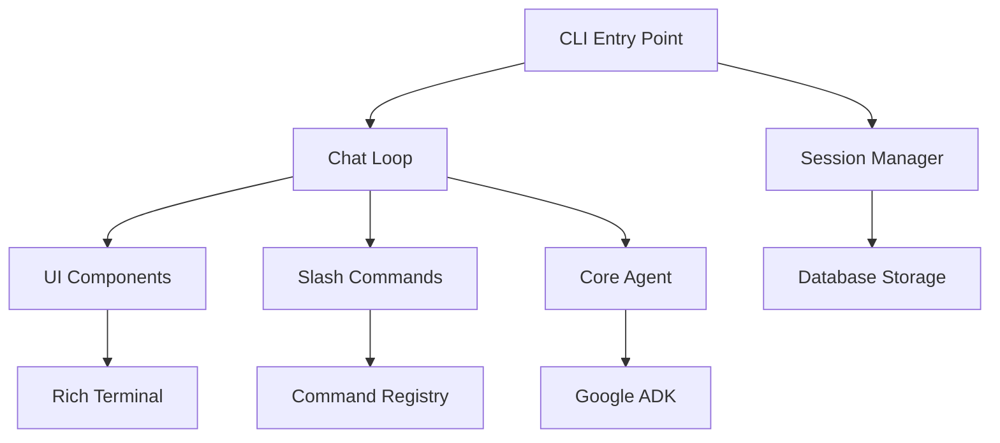

# Murlix

<div class="hero-section">
  <div class="hero-content">
    <h1 class="hero-title">Beautiful CLI Chat Interface</h1>
    <p class="hero-subtitle">A modern, feature-rich command-line experience for interacting with AI agents, powered by Google's Agent Development Kit (ADK).</p>
    <div class="hero-buttons">
      <a href="getting-started/installation/" class="btn btn-primary">Get Started</a>
      <a href="https://github.com/manohar3000/murlix" class="btn btn-secondary">View on GitHub</a>
    </div>
  </div>
</div>

## ✨ Why Murlix?

Murlix transforms your terminal into a beautiful, interactive chat interface that makes AI conversations feel natural and engaging. Built with modern Python and powered by Google's ADK, it brings the power of advanced AI agents directly to your command line.

<div class="feature-grid">
  <div class="feature-card">
    <div class="feature-icon">🎨</div>
    <h3>Beautiful Interface</h3>
    <p>Rich terminal UI with ASCII art, elegant formatting, and responsive design that makes CLI interactions delightful.</p>
  </div>
  
  <div class="feature-card">
    <div class="feature-icon">💬</div>
    <h3>Interactive Chat</h3>
    <p>Seamless conversation experience with intelligent responses, context awareness, and natural dialogue flow.</p>
  </div>
  
  <div class="feature-card">
    <div class="feature-icon">📚</div>
    <h3>Session Management</h3>
    <p>Persistent sessions that survive application restarts, allowing you to continue conversations anytime.</p>
  </div>
  
  <div class="feature-card">
    <div class="feature-icon">🔄</div>
    <h3>Session Continuation</h3>
    <p>Resume your last conversation or pick from any previous session with intuitive session selection.</p>
  </div>
  
  <div class="feature-card">
    <div class="feature-icon">🛠️</div>
    <h3>Slash Commands</h3>
    <p>Built-in commands for enhanced functionality, from session management to system operations.</p>
  </div>
  
  <div class="feature-card">
    <div class="feature-icon">📱</div>
    <h3>Modern UX</h3>
    <p>Loading indicators, status panels, and responsive design that adapts to your terminal size.</p>
  </div>
</div>

## 🚀 Quick Start

Get up and running with Murlix in minutes:

=== "Installation"

    ```bash
    # Clone the repository
    git clone https://github.com/manohar3000/murlix.git
    cd murlix
    
    # Install dependencies
    uv sync
    ```

=== "Basic Usage"

    ```bash
    # Start interactive chat
    uv run murlix
    
    # Continue last session
    uv run murlix continue-chat
    
    # One-time query
    uv run murlix --query "Hello, how are you?"
    ```

=== "Configuration"

    ```bash
    # Set up environment (optional)
    cp .env.example .env
    # Edit .env with your API keys
    ```

## 💡 Example Interaction

See Murlix in action with its beautiful terminal interface:

```bash
$ uv run murlix

╭─ Welcome to Murlix ───────────────────────────────────────────────────────────╮
│                                                                               │
│  ███╗   ███╗██╗   ██╗██████╗ ██╗     ██╗██╗  ██╗                             │
│  ████╗ ████║██║   ██║██╔══██╗██║     ██║╚██╗██╔╝                             │
│  ██╔████╔██║██║   ██║██████╔╝██║     ██║ ╚███╔╝                              │
│  ██║╚██╔╝██║██║   ██║██╔══██╗██║     ██║ ██╔██╗                              │
│  ██║ ╚═╝ ██║╚██████╔╝██║  ██║███████╗██║██╔╝ ██╗                             │
│  ╚═╝     ╚═╝ ╚═════╝ ╚═╝  ╚═╝╚══════╝╚═╝╚═╝  ╚═╝                             │
│                                                                               │
│  A beautiful CLI chat interface powered by Google's ADK                       │
│                                                                               │
╰───────────────────────────────────────────────────────────────────────────────╯

You: Hello, how can you help me today?

╭─ Murlix ─────────────────────────────────────────────────────────────────────╮
│ Hello! I'm Murlix, your AI assistant. I can help you with a wide variety of  │
│ tasks including:                                                              │
│                                                                               │
│ • Answering questions and providing information                               │
│ • Writing and reviewing code                                                  │
│ • Creative writing and brainstorming                                          │
│ • Problem-solving and analysis                                                │
│ • And much more!                                                              │
│                                                                               │
│ Try typing /help to see available commands, or just start chatting!          │
╰──────────────────────────────────────────────────────────────────────────────╯
```

## 🏗️ Architecture

Murlix is built with a clean, modular architecture that makes it easy to extend and customize:



## 📖 What's Next?

<div class="next-steps">
  <div class="step">
    <h3>🚀 <a href="getting-started/installation/">Get Started</a></h3>
    <p>Install Murlix and set up your first chat session</p>
  </div>
  
  <div class="step">
    <h3>📚 <a href="user-guide/interactive-mode/">Learn the Basics</a></h3>
    <p>Explore interactive mode, sessions, and slash commands</p>
  </div>
  
  <div class="step">
    <h3>🛠️ <a href="developer-guide/extending/">Extend Murlix</a></h3>
    <p>Add custom commands and configure your AI agent</p>
  </div>
  
  <div class="step">
    <h3>🔧 <a href="api-reference/cli-commands/">API Reference</a></h3>
    <p>Detailed documentation of all commands and modules</p>
  </div>
</div>

---

<div class="footer-cta">
  <h2>Ready to transform your CLI experience?</h2>
  <p>Join the growing community of developers using Murlix for beautiful AI-powered terminal interactions.</p>
  <a href="getting-started/installation/" class="btn btn-primary btn-large">Start Building →</a>
</div>