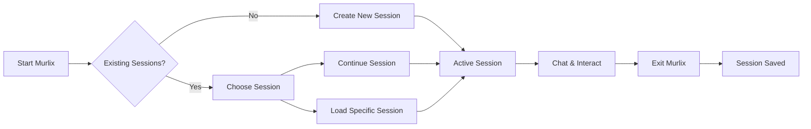

# Session Management

Murlix's powerful session management system allows you to maintain persistent conversations across multiple sessions, resume previous discussions, and organize your AI interactions effectively.

## Understanding Sessions

### What is a Session?

A session in Murlix represents a complete conversation thread with the AI agent. Each session:

- **Maintains Context**: All previous messages and responses are remembered
- **Persists Data**: Survives application restarts and system reboots
- **Has Unique ID**: Each session gets a unique identifier for easy reference
- **Stores Metadata**: Creation time, last activity, and status information

### Session Lifecycle



## Session Commands

### Creating New Sessions

**Automatic Creation**:
```bash
# Starting Murlix automatically creates a new session
uv run murlix
```

**Manual Creation**:
```bash
# Use the /new command in interactive mode
You: /new
```

### Continuing Sessions

**Continue Latest Session**:
```bash
uv run murlix continue-chat
```

This command:
- Automatically loads your most recent session
- Resumes conversation with full context
- Creates new session if none exist

**Load Specific Session**:
```bash
uv run murlix load-chat
```

This presents an interactive session picker:
```
                           Available Sessions                            
┏━━━━━━━━━━┳━━━━━━━━━━━━━━━━━━━━━━┳━━━━━━━━━━━━━━━━━━━━━━┳━━━━━━━━━━━━━━┓
┃ Index    ┃ Session ID           ┃ Created At           ┃ Status       ┃
┡━━━━━━━━━━╇━━━━━━━━━━━━━━━━━━━━━━╇━━━━━━━━━━━━━━━━━━━━━━╇━━━━━━━━━━━━━━┩
│ 1        │ abc123def456...      │ 2024-01-15 14:30:25  │ Current      │
│ 2        │ def456ghi789...      │ 2024-01-14 09:15:42  │ Active       │
│ 3        │ ghi789jkl012...      │ 2024-01-13 16:22:10  │ Active       │
└──────────┴──────────────────────┴──────────────────────┴──────────────┘

Select a session by index (or 'n' for new session) (1):
```

### Viewing Sessions

**In Interactive Mode**:
```
You: /sessions
```

**Via CLI**:
```bash
uv run murlix sessions list
```

## Session Organization

### Naming Strategy

While sessions don't have explicit names, you can organize them effectively:

**Use Descriptive First Messages**:
```
✓ "Working on Python web scraper for e-commerce data"
✓ "Learning React hooks and state management"
✓ "Debugging authentication issues in Django app"

✗ "Hi"
✗ "Help me"
✗ "Question"
```

### Session Categories

Organize your sessions by purpose:

=== "Development Projects"
    - **Code Reviews**: "Review my authentication module"
    - **Bug Fixing**: "Debugging memory leak in Node.js app"
    - **Learning**: "Understanding async/await patterns"
    - **Architecture**: "Designing microservices architecture"

=== "Research & Learning"
    - **Concepts**: "Learning machine learning fundamentals"
    - **Comparisons**: "React vs Vue.js pros and cons"
    - **Best Practices**: "Python testing best practices"
    - **Tutorials**: "Building REST API with FastAPI"

=== "Problem Solving"
    - **Troubleshooting**: "Fixing Docker container networking issues"
    - **Optimization**: "Improving database query performance"
    - **Design**: "UI/UX design for mobile app"
    - **Strategy**: "Choosing tech stack for startup"

## Advanced Session Features

### Context Preservation

Murlix maintains conversation context across sessions:

```
Session 1 (Day 1):
You: I'm building a todo app with React and need help with state management.
Murlix: I can help you with React state management...

Session 1 (Day 2):
You: Following up on yesterday's discussion about state management...
Murlix: Of course! We were discussing React state management for your todo app...
```

### Session Metadata

Each session stores:

- **Creation Timestamp**: When the session was first created
- **Last Activity**: Most recent interaction time
- **Message Count**: Number of exchanges in the session
- **Status**: Current session state (Active, Archived, etc.)
- **User Context**: Your user ID and preferences

### Cross-Session References

You can reference previous sessions:

```
You: In a previous session, we discussed React hooks. Can you continue that discussion?
Murlix: While I don't have direct access to your previous sessions, I'd be happy to discuss React hooks...
```

## Session Management Best Practices

### Organization Tips

!!! tip "Effective Session Management"
    - **One Topic Per Session**: Keep sessions focused on specific topics or projects
    - **Descriptive Openings**: Start with clear, contextual first messages
    - **Regular Cleanup**: Periodically review and clean up old sessions
    - **Strategic Continuation**: Continue sessions when building on previous work

### Performance Considerations

**Session Size**:
- Very long sessions may slow down responses
- Consider starting new sessions for major topic changes
- Archive completed project sessions

**Context Management**:
- Murlix automatically manages conversation context
- Recent messages have more weight in responses
- Very old messages in long sessions may have less influence

### Workflow Patterns

#### Project-Based Workflow
```bash
# Start new session for each project
uv run murlix  # "Starting new e-commerce project with Django"

# Continue project sessions
uv run murlix continue-chat  # Continue working on the same project

# Switch between projects
uv run murlix load-chat  # Pick different project session
```

#### Topic-Based Workflow
```bash
# Dedicated sessions for different learning topics
# Session 1: "Learning Python async programming"
# Session 2: "Understanding Docker containerization"  
# Session 3: "React performance optimization"
```

#### Daily Workflow
```bash
# Morning: Continue yesterday's work
uv run murlix continue-chat

# During day: Quick questions without sessions
uv run murlix -q "How do I handle CORS in Express?"

# Evening: Wrap up and plan tomorrow
# End sessions naturally or start planning session
```

## Session Data Management

### Data Storage

Sessions are stored locally in SQLite database:
- **Location**: `my_agent_data.db` (configurable)
- **Format**: Structured relational data
- **Privacy**: Completely local, under your control

### Backup and Export

**Export Sessions**:
```bash
# Export all sessions to JSON
uv run murlix sessions export --output sessions_backup.json

# Export specific session
uv run murlix sessions export abc123def456 --format txt

# Export recent sessions
uv run murlix sessions export --recent 30  # Last 30 days
```

**Backup Database**:
```bash
# Simple file copy
cp my_agent_data.db backup_$(date +%Y%m%d).db

# Automated backup script
#!/bin/bash
BACKUP_DIR="$HOME/murlix_backups"
mkdir -p "$BACKUP_DIR"
cp my_agent_data.db "$BACKUP_DIR/murlix_$(date +%Y%m%d_%H%M%S).db"
```

### Session Cleanup

**Delete Old Sessions**:
```bash
# Delete sessions older than 30 days
uv run murlix sessions delete --older-than 30

# Delete specific session
uv run murlix sessions delete abc123def456

# Delete all sessions (with confirmation)
uv run murlix sessions delete --all
```

**Archive Sessions**:
```bash
# Export before deleting
uv run murlix sessions export --older-than 90 --output old_sessions.json
uv run murlix sessions delete --older-than 90
```

## Troubleshooting Sessions

### Common Issues

!!! failure "Session Not Found"
    **Problem**: Session ID doesn't exist
    
    **Solutions**:
    - Use `/sessions` to list available sessions
    - Check if session was accidentally deleted
    - Verify you're in the correct database location

!!! failure "Context Not Preserved"
    **Problem**: AI doesn't remember previous conversation
    
    **Solutions**:
    - Ensure you're continuing the correct session
    - Check session wasn't corrupted
    - Very long sessions may lose early context

!!! failure "Database Errors"
    **Problem**: Cannot access or create sessions
    
    **Solutions**:
    - Check database file permissions
    - Verify disk space availability
    - Try deleting corrupted database (loses all sessions)

### Recovery Options

**Database Corruption**:
```bash
# Backup current database
cp my_agent_data.db corrupted_backup.db

# Start fresh (loses all sessions)
rm my_agent_data.db
uv run murlix  # Creates new database
```

**Session Recovery**:
```bash
# If you have exported sessions
uv run murlix sessions import sessions_backup.json
```

## Integration with Development Workflow

### Git Integration

Track session exports with your projects:

```bash
# In your project directory
uv run murlix sessions export --project-related --output docs/ai_sessions.json
git add docs/ai_sessions.json
git commit -m "Add AI assistance session history"
```

### IDE Integration

Use sessions alongside your development environment:

```bash
# Terminal 1: Your development work
vim src/main.py

# Terminal 2: Murlix for assistance
uv run murlix continue-chat
```

### Team Collaboration

Share session insights (not full sessions for privacy):

```bash
# Export session summaries
uv run murlix sessions export --summary-only --output team_insights.md
```

## Next Steps

- **[Slash Commands](slash-commands.md)**: Learn about built-in commands
- **[Advanced Usage](advanced-usage.md)**: Explore power-user features
- **[Interactive Mode](interactive-mode.md)**: Master the chat interface

!!! success "Session Management Mastery"
    With effective session management, you can maintain long-term AI collaborations, organize your work efficiently, and build a valuable knowledge base of your interactions.