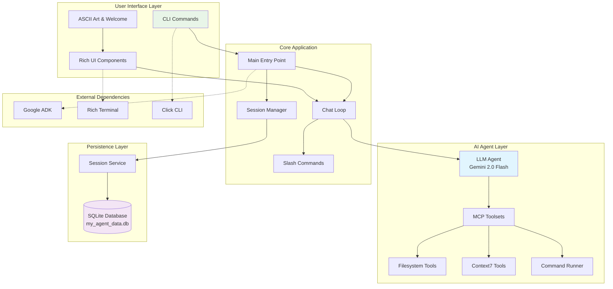
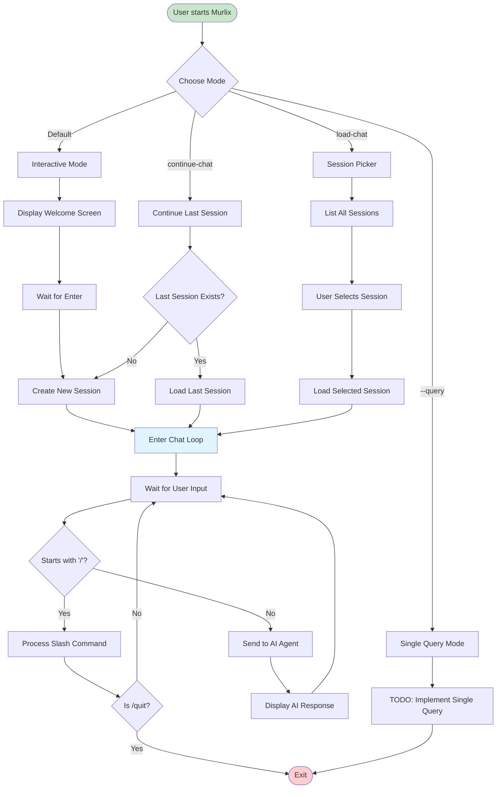
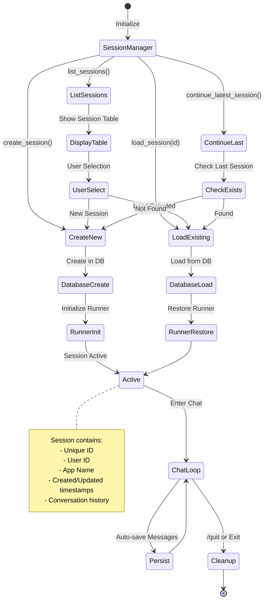
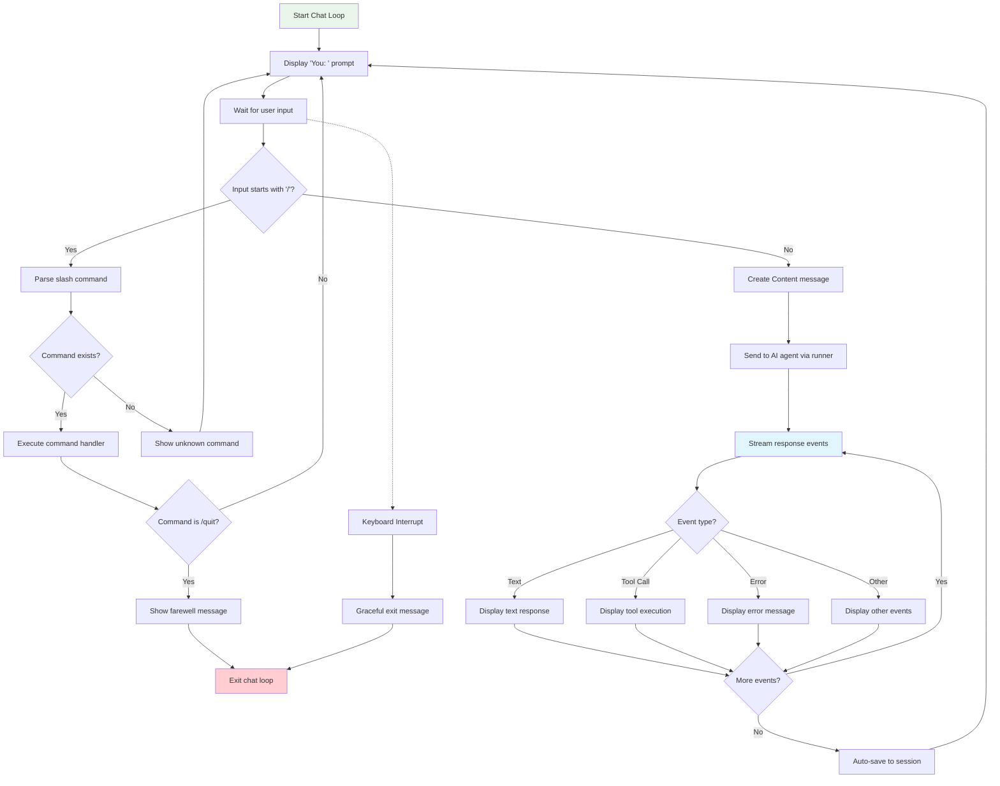
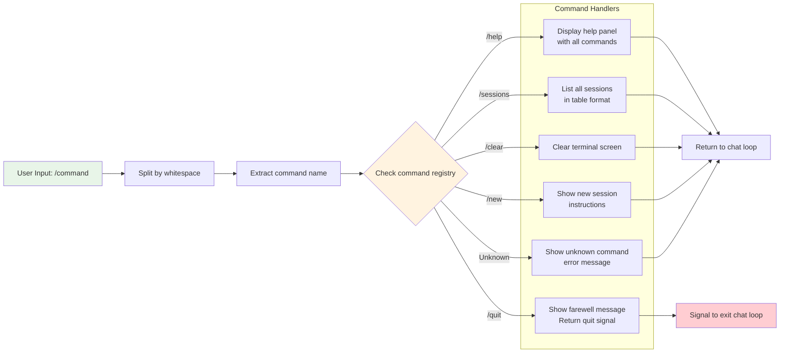
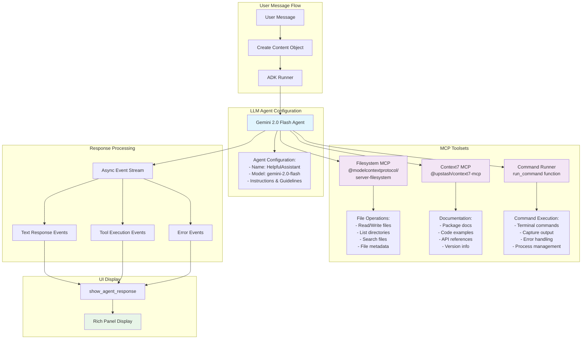
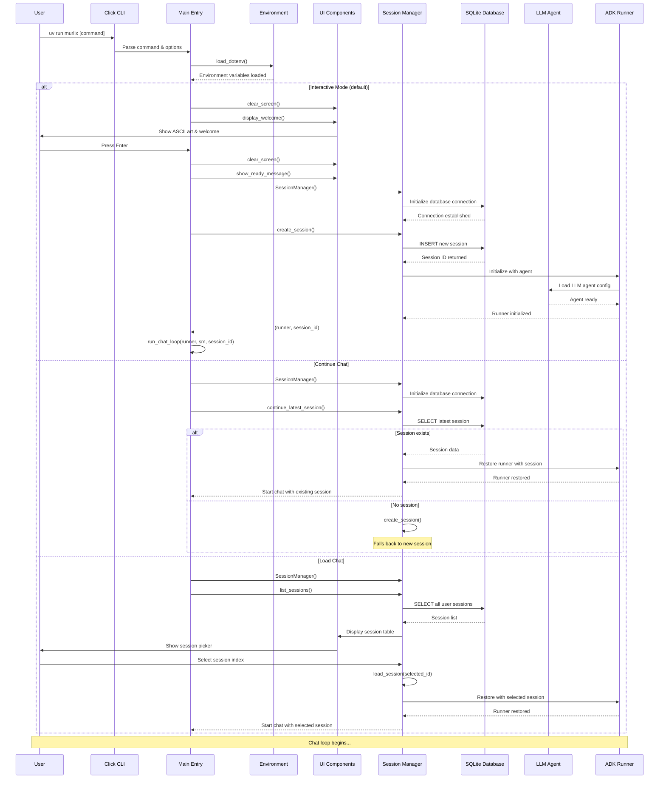
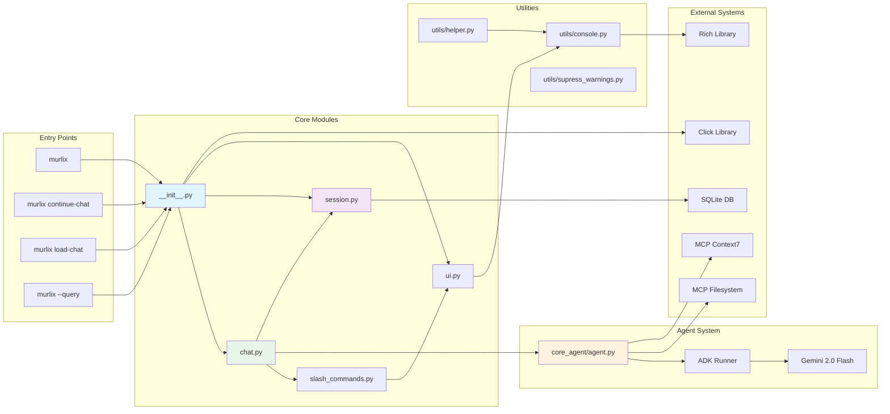
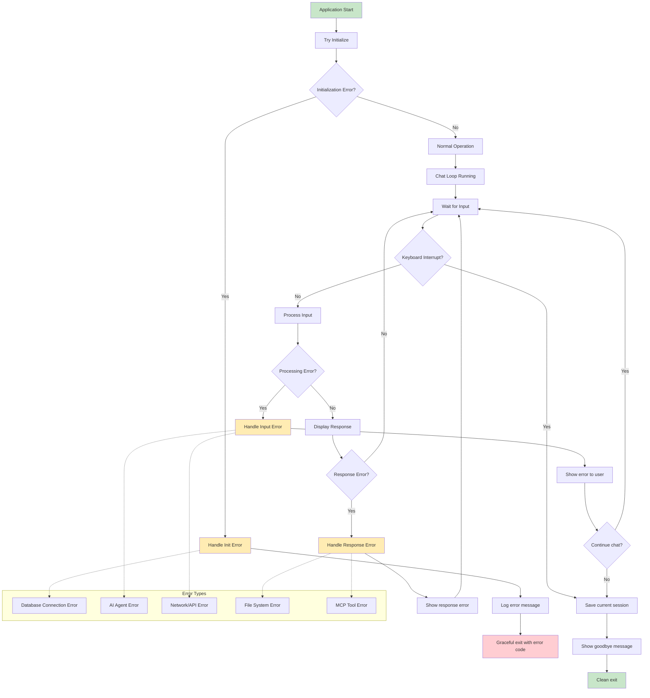

# Murlix Tool - Architecture and Flow Diagrams

This document contains various Mermaid diagrams explaining the working of the Murlix CLI chat interface tool.

## 1. High-Level Architecture Overview



## 2. User Interaction Flow



## 3. Session Management Lifecycle



## 4. Chat Loop Detailed Flow



## 5. Slash Commands Processing



## 6. AI Agent and Tools Integration



## 7. Database Schema and Session Persistence

```mermaid
erDiagram
    SESSIONS {
        string session_id PK
        string app_name
        string user_id
        datetime created_at
        datetime updated_at
        string status
        json metadata
    }
    
    MESSAGES {
        string message_id PK
        string session_id FK
        string role
        text content
        datetime timestamp
        json parts
        string event_type
    }
    
    EVENTS {
        string event_id PK
        string session_id FK
        string event_type
        json event_data
        datetime timestamp
        string status
    }
    
    USERS {
        string user_id PK
        string app_name
        datetime first_seen
        datetime last_active
        json preferences
    }
    
    SESSIONS ||--o{ MESSAGES : contains
    SESSIONS ||--o{ EVENTS : generates
    USERS ||--o{ SESSIONS : owns
    
    SESSIONS {
        string "Unique identifier"
        string "Application name (cwd)"
        string "User identifier"
        datetime "Session creation time"
        datetime "Last activity time"
        string "Active/Inactive"
        json "Additional session data"
    }
    
    MESSAGES {
        string "Unique message ID"
        string "Parent session"
        string "user/assistant/system"
        text "Message content"
        datetime "When sent/received"
        json "Message parts/attachments"
        string "text/tool_call/error"
    }
```

## 8. Application Startup Sequence



## 9. Component Interaction Network



## 10. Error Handling and Recovery Flow



## 11. Configuration and Environment Setup

```mermaid
graph TB
    subgraph "Environment Configuration"
        ENV_FILE[.env file]
        ENV_VARS[Environment Variables]
        DEFAULTS[Default Values]
    end
    
    subgraph "Configuration Options"
        USER_ID[USER_ID<br/>default: "default_user"]
        GOOGLE_API[GOOGLE_API_KEY<br/>for Google AI API]
        VERTEX_PROJECT[VERTEX_AI_PROJECT<br/>for Vertex AI]
        VERTEX_LOCATION[VERTEX_AI_LOCATION<br/>for Vertex AI]
    end
    
    subgraph "Agent Configuration"
        MODEL[Model: gemini-2.0-flash]
        NAME[Name: HelpfulAssistant]
        INSTRUCTIONS[System Instructions]
        TOOLS_CONFIG[MCP Tools Configuration]
    end
    
    subgraph "Database Configuration"
        DB_URL[Database URL<br/>sqlite:///./my_agent_data.db]
        APP_NAME[App Name<br/>from current directory]
        SCHEMA[Auto-created schema]
    end
    
    subgraph "MCP Tools Setup"
        FS_TOOL[Filesystem Tool<br/>@modelcontextprotocol/server-filesystem]
        CTX_TOOL[Context7 Tool<br/>@upstash/context7-mcp]
        CMD_TOOL[Command Runner<br/>Custom function]
        
        ALLOWED_PATH[Allowed Path<br/>Current working directory]
    end
    
    ENV_FILE --> ENV_VARS
    ENV_VARS --> USER_ID
    ENV_VARS --> GOOGLE_API
    ENV_VARS --> VERTEX_PROJECT
    ENV_VARS --> VERTEX_LOCATION
    
    DEFAULTS --> USER_ID
    
    USER_ID --> DB_URL
    APP_NAME --> DB_URL
    DB_URL --> SCHEMA
    
    MODEL --> AGENT_CONFIG[Agent Instance]
    NAME --> AGENT_CONFIG
    INSTRUCTIONS --> AGENT_CONFIG
    TOOLS_CONFIG --> AGENT_CONFIG
    
    FS_TOOL --> TOOLS_CONFIG
    CTX_TOOL --> TOOLS_CONFIG
    CMD_TOOL --> TOOLS_CONFIG
    
    ALLOWED_PATH --> FS_TOOL
    ALLOWED_PATH --> CMD_TOOL
    
    style ENV_FILE fill:#e8f5e8
    style AGENT_CONFIG fill:#e1f5fe
    style SCHEMA fill:#f3e5f5
    style ALLOWED_PATH fill:#ffecb3
```

## Summary

These diagrams provide a comprehensive overview of the Murlix tool's architecture and operation:

1. **Architecture Overview** - Shows the layered structure and component relationships
2. **User Interaction Flow** - Illustrates different ways users can interact with the tool
3. **Session Management** - Details the lifecycle of chat sessions and persistence
4. **Chat Loop Flow** - Explains the core conversation handling logic
5. **Slash Commands** - Shows how built-in commands are processed
6. **AI Agent Integration** - Demonstrates the integration with Google ADK and MCP tools
7. **Database Schema** - Details the data model for session persistence
8. **Startup Sequence** - Shows the initialization process for different modes
9. **Component Network** - Illustrates module dependencies and interactions
10. **Error Handling** - Shows error recovery and graceful degradation
11. **Configuration** - Details environment setup and configuration options

Murlix is a well-architected CLI tool that provides a beautiful interface for AI chat interactions with robust session management, extensible command system, and powerful tool integration through the Model Context Protocol (MCP).